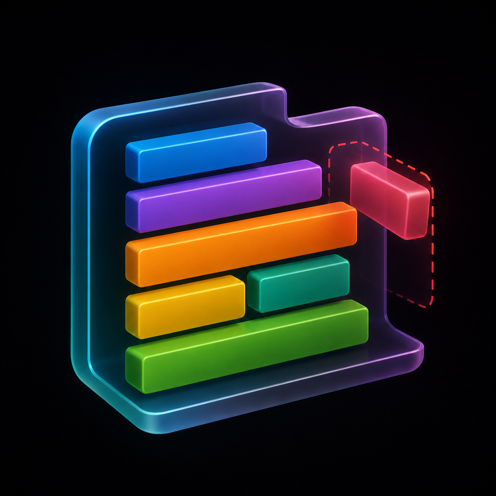
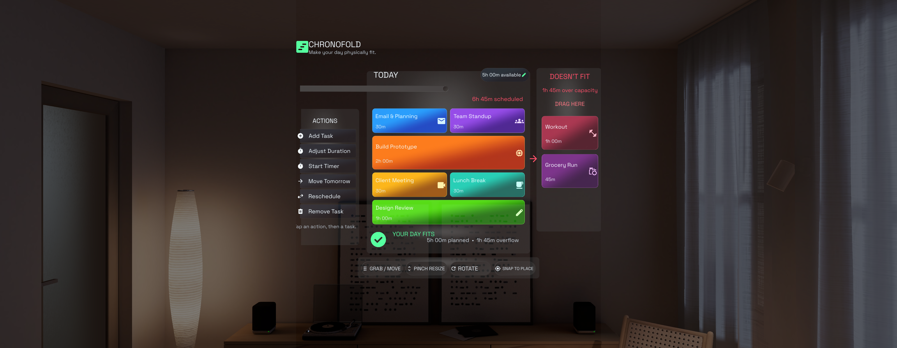
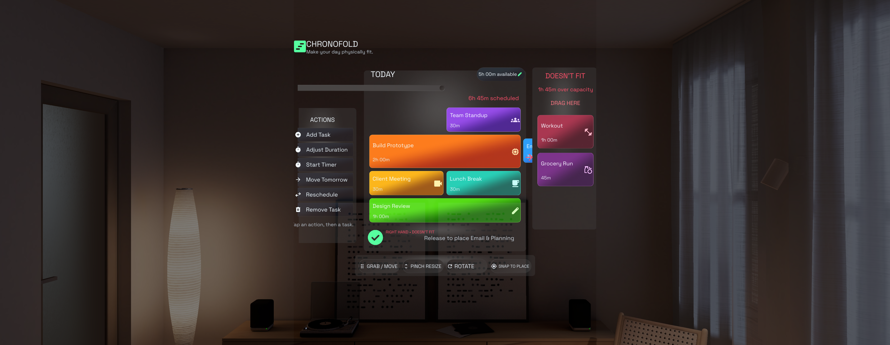
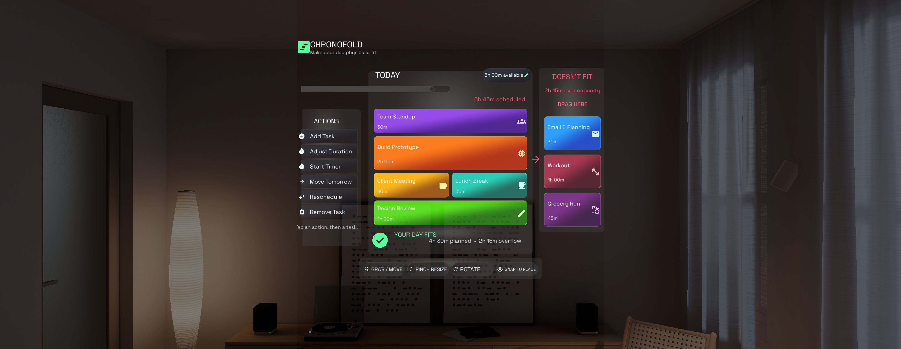
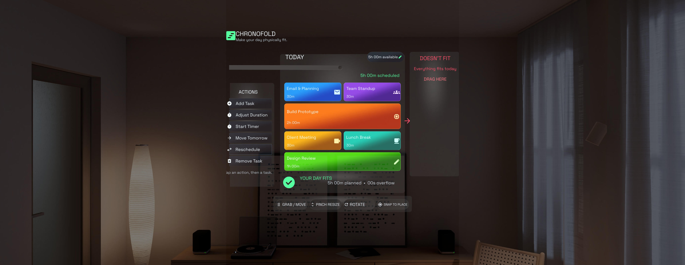
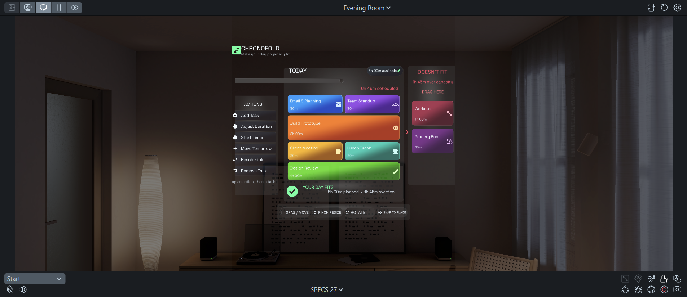

# Chronofold

<p align="center">
  
</p>

<p align="center"><strong>Make your day physically fit.</strong></p>

Chronofold is a spatial productivity planner for Snap Spectacles where tasks take up physical space and overloaded days literally do not fit.



## Hackathon context

Chronofold was built as a Snap Spectacles hackathon project using Lens Studio, Spectacles Interaction Kit, Spectacles UIKit, and the CLAD development workflow. The project explores a simple question: can a schedule become easier to understand when time is represented as something with visible size, position, and capacity?

## The problem

Most planners reduce a day to a list. A list can keep growing even when the available time cannot. That makes overcommitment easy to miss until the day is already underway.

Chronofold turns the schedule into a bounded spatial surface. Tasks occupy cards, the day has an editable time capacity, and work that exceeds that capacity is placed in a separate `DOESN'T FIT` lane. The result makes the tradeoff visible before the user starts working.

## How the experience works

1. The Today panel shows scheduled tasks as colored cards.
2. The capacity pill defines how much time is available for the day.
3. The meter compares scheduled time with the configured capacity.
4. Tasks beyond the planned day live in the overflow lane.
5. A user can grab a card with either hand, or drag with the Preview cursor, and move it between Today and overflow.
6. Cards are rebuilt into the correct lane and the remaining layout closes the gap.
7. Actions provide guided flows for creating, editing, timing, rescheduling, moving, and removing tasks.

## Key features

- Spatial task cards with duration, color, and category icons
- Editable day capacity from 1 minute to 24 hours
- Visible scheduled time and overflow totals
- Left-hand and right-hand index-thumb pinch tracking
- Mouse and touch dragging in Lens Studio Preview
- Automatic card reflow after a lane change
- Add Task flow with task name plus hours, minutes, and seconds
- Adjust Duration flow with task selection and duration input
- Move Tomorrow and Reschedule flows backed by a logical Tomorrow queue
- Remove Task confirmation
- Per-task start, pause, resume, stop, and completion timer states
- In-Lens timer completion alert
- Short grab and drop sound feedback
- Deterministic functional self-test mode for Preview

## Interaction model

| Intent | Spectacles interaction | Lens Studio Preview |
| --- | --- | --- |
| Select an action | Poke or pinch the action button | Click the action button |
| Select a task for an action | Pinch its card handle | Click the task card |
| Move a task | Pinch the handle, move, then release over Today or overflow | Drag the card between Today and overflow |
| Edit day capacity | Select the capacity pill and enter hours and minutes | Click the capacity pill and use the Preview keyboard |
| Enter task text | Spectacles text input keyboard | Preview text input |
| Start or manage a timer | Choose Start Timer, select a task, then use the timer controls | Use the same guided flow |

The toolbar labels below the board are visual orientation cues. The implemented task movement path is the task-card drag interaction described above.

## Screenshots

All screenshots below were captured from the completed Lens in Lens Studio Preview.

### Overcapacity at a glance

The default sample schedule plans five hours in Today and keeps one hour and forty-five minutes in overflow.


### Moving a task

During a pinch drag, the card follows the hand and the status area identifies the active hand and destination.



### Automatic reflow

After the card is released, the source lane closes its gap and the destination lane rebuilds its stack.



### Successful fit

Moving the overflow tasks to the logical Tomorrow queue clears the overflow lane and updates the totals.



### Lens Studio verification frame



## Architecture overview

Chronofold separates schedule state from presentation.

```text
ChronofoldMain
  owns tasks, capacity, actions, timer, and mutations
             |
             | events and render models
             v
ChronofoldDashboardUI
  builds UIKit panels, cards, prompts, and interaction adapters
             |
             v
Spectacles Interaction Kit + Lens Studio input events
  hand tracking, poke targets, Preview mouse and touch input
```

The authored scene contains the SIK rig, lighting, a canvas view rig, the `Chronofold App` state controller, and the `Chronofold Dashboard` UI controller. The detailed component and event flow is documented in [ARCHITECTURE.md](ARCHITECTURE.md).

## Technical implementation

### Task and scheduling state

`ChronofoldSceneContracts.ts` defines the task shape, lane names, initial task data, and duration conversion. Each task has a stable key, label, duration, lane, icon, palette index, and an optional half-width layout flag.

`ChronofoldMain.ts` owns the mutable task array. It also owns the pending action state, selected task, editable capacity, timer state, audio components, and all schedule mutations. UI callbacks are subscribed once during startup.

### Capacity logic

Capacity is stored in seconds after input validation. The current release accepts a value from 1 minute through 24 hours.

```text
todaySeconds    = sum(duration of tasks in Today)
overflowSeconds = sum(duration of tasks in Doesn't Fit)
scheduledSeconds = todaySeconds + overflowSeconds
```

New tasks are placed in Today only when their duration fits within the remaining Today capacity. Otherwise they are placed in overflow. Increasing a task duration can also move that task to overflow when Today would exceed capacity. A capacity edit updates the meter and totals but does not automatically rebalance existing cards.

### Adaptive layout and reflow

The dashboard is assembled at runtime with Spectacles UIKit primitives and Lens Studio scene objects. Today uses paired half-width cards where possible and full-width rows for longer tasks. Overflow uses a vertical stack. After a mutation, both lanes are rebuilt from the current model, which removes stale card geometry and closes gaps left by moved or removed tasks.

### Spectacles Interaction Kit

The scene includes the SIK core configuration, left and right hand interactors, hand visuals, a mobile interactor, and a mouse interactor. UIKit buttons use SIK interactables. Task cards use a custom adapter built on `HandInputData`, with nearest-handle selection and real-time index-thumb pinch tracking for both hands. This avoids retaining stale interactable targets when the card stack is rebuilt.

Preview cursor dragging is implemented separately with `TouchStartEvent`, `TouchMoveEvent`, and `TouchEndEvent`, plus camera screen-to-world conversion. This keeps mouse testing available in Lens Studio Preview.

### Text and duration input

Guided workflows use `TextInputSystem`. Task names use the text keyboard. Durations use numeric input in hours, minutes, and seconds. Capacity uses numeric hours and minutes. Input is validated before state changes are applied.

### Timer

The timer runs from `UpdateEvent` and uses Lens time to calculate the remaining duration. The controller supports start, pause, resume, stop, and one-time completion. Completion opens an in-Lens alert and updates the task state. It does not create a system notification outside the Lens.

## Project structure

```text
Chronofold/
|-- Assets/
|   |-- Fonts/                     Space Grotesk
|   |-- GeneratedSFX/              grab and drop feedback
|   |-- Icons/                     task and action icons
|   |-- Materials/                 runtime image material
|   |-- Render/                    camera and render assets
|   |-- Scripts/
|   |   |-- ChronofoldSceneContracts.ts
|   |   |-- ChronofoldMain.ts
|   |   `-- ChronofoldDashboardUI.ts
|   `-- Scene.scene
|-- Packages/                      SIK, UIKit, and Preview tooling
|-- design/                        logo and canonical design reference
|-- docs/images/                   verified release screenshots
|-- ARCHITECTURE.md
|-- CLAD_PROMPT_LOG.md
|-- DESIGN.md
|-- TESTING.md
`-- Chronofold.esproj
```

Generated caches, editor workspaces, local MCP configuration, debug keys, development captures, and machine-specific settings are excluded by `.gitignore`.

## Requirements

- Lens Studio 5.23.1 or a compatible newer version
- A desktop system supported by Lens Studio
- Spectacles target support
The repository includes the Lens Studio package files used by the project, including Spectacles Interaction Kit and Spectacles UIKit.

## Open and run

1. Clone the repository.
2. Open `Chronofold.esproj` in Lens Studio.
3. Allow Lens Studio to import the assets and rebuild generated caches.
4. Confirm the target is Spectacles.
5. Open the Preview panel and select an interactive Specs environment.
6. Compile TypeScript.
7. Press Start in Preview.

The sample schedule should appear with six tasks in Today and two tasks in overflow. The Logger should print the SIK version, the initial schedule totals, the ready message, and the hand-tracking ready message.

## CLAD development workflow

The project was developed through repeated scene inspection, implementation, TypeScript compilation, Preview interaction, log review, screenshot capture, and visual comparison. CLAD and Codex used the Lens Studio integration for scene reads, runtime queries, input simulation, compilation, and Preview screenshots.

The honest iteration record, including failed layout changes and regression fixes, is in [CLAD_PROMPT_LOG.md](CLAD_PROMPT_LOG.md). The final verification procedure is in [TESTING.md](TESTING.md).

## Design decisions

- Duration is shown as text and reinforced by card grouping and row size.
- Overflow is a separate physical lane instead of a warning badge hidden in a menu.
- The board uses a restrained dark glass surface so task colors remain the primary visual signal.
- The active board is built at runtime from one state model, which keeps visual reflow consistent after mutations.
- Hand input and Preview cursor input share the same task-drop API so both paths change the same schedule state.
- Capacity is explicit and editable because available time varies from day to day.

More detail is available in [DESIGN.md](DESIGN.md).

## Future possibilities

- A visible Tomorrow board with navigation and drag targets
- Persistent schedules backed by Snap Cloud
- Automatic capacity-aware task suggestions
- Calendar import and export
- Voice task entry
- Shared planning for colocated Spectacles users
- Device notification integration where the platform permits it
- Accessibility settings for scale, contrast, handedness, and motion

## Hackathon submission information

- Platform: Snap Spectacles
- Engine: Lens Studio 5.23.1
- Primary language: TypeScript
- Interaction: SIK hand tracking, UIKit actions, and Preview cursor input
- Development workflow: CLAD and Codex with the Lens Studio integration
- Repository: <https://github.com/Dairus01/Chronofold.git>

## Credits

- Project and implementation: [Dairus01](https://github.com/Dairus01)
- Lens Studio, Spectacles Interaction Kit, and Spectacles UIKit: Snap Inc.
- Interface typeface: Space Grotesk
- Interface symbols: Google Material Symbols
- Development assistance and verification: CLAD and Codex
